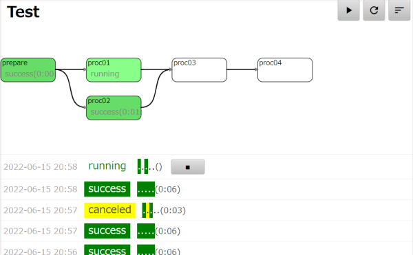

# WIP: Lightweight Script Runner

事前に登録したタスクをブラウザやREST APIから実行する簡易タスクランナーです．

- ブラウザからJavaScriptやシェルスクリプトで書かれた処理の実行・停止・結果の確認ができます
- 任意のDAGとして表現されたタスクを実行できます
- Cronスタイルのスケジュールを登録できます
- **とりあえずシェルスクリプトを置くだけでタスクとして登録されます**
- **Webサーバ含めて数MBのメモリで動作するので，ラズパイやNASとかで動かしても邪魔になりません**
- [Airflow](https://airflow.apache.org/) や [Dagu](https://github.com/yohamta/dagu) 等の影響を少し受けています



## Usage

起動すると port 8080 で待ち受けているのでブラウザで開いてください．

ポート番号は `GOTASK_HTTP_PORT` 環境変数で変更できます．

## Folder structure

- gotask
- tasks/
   - test01.sh
   - test02.1.sh
   - test02.2.sh
   - test02.3.sh
   - test03.yaml
- logs/

上の例では，`test01`, `test02`, `test03` というタスクが存在しています．
`test02`は1,2,3というサブタスクが順番に実行されます．
`test03`はyamlで任意の依存関係のコマンドを記述できます．

## YAML

サブタスクなしの場合：

```yaml
env:
  STR1: "Hello"
variables:
  STR2: "world"
command: echo "$STR1, $STR2!"
```

variableはenvと同様ですがREST APIから実行するときに値を変更できます．

サブタスク：

```yaml
steps:
  - name: step1
    env:
      STR: "world"
    variables:
      STR2: "..."
    command: echo "Hello, $STR! $STR2"
  - name: step2
    command: sleep 1
    depends:
      - step1
  - name: step3
    command: sleep 1
    depends:
      - step1
      - step2
```

## JavaScript

部分的なサポートですが、fs, child_process, fetch APIあたりは動作します。

1秒待ってから、Hello, world!を返すタスクの例。(handlerの定義はAWS Lambda互換です)

```js
exports.handler = async (event) => {
    await new Promise((r) => setTimeout(r, 1000));
    return {
        "statusCode": 200,
        "headers": {
            "Content-Type": "text/plan",
        },
        "body": "Hello, world!"
    };
};
```

```js
exports.handler = async (event) => {
    await new Promise((r) => setTimeout(r, 1000));
    return "Hello, world!";
};
```
